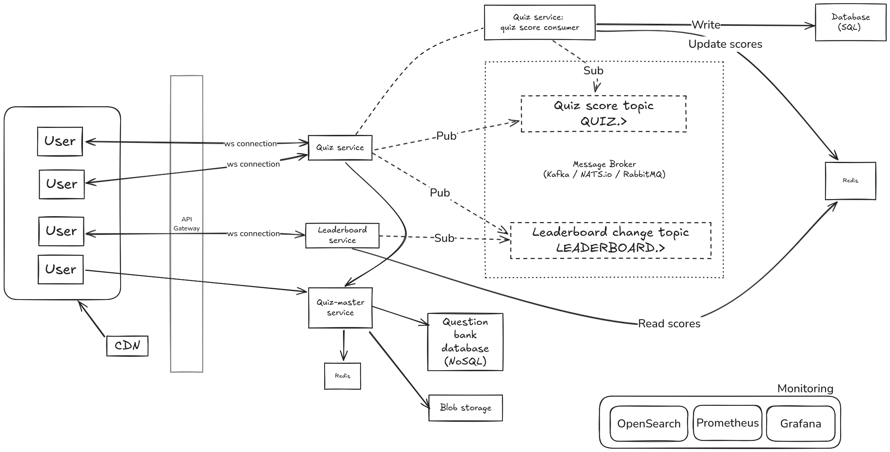

# ELSA

ELSA SPEAK's coding challenge

[Introduction](README#Introduction)
[Technical demo](<README#Technical demo>)
  - [Setup](README#Setup)
  - [Leaderboard](README#Leaderboard)

## Introduction

In this repo, you'll find:

- a high level design breakdown for a real-time quiz feature for an English learning application.
- a working demo for the live update leaderboard written in Python. 
- an instruction to run the demo.

## Technical demo

In this demo, I've chosen to focus on the `real-time leaderboard` component. 
The score updates and user participation are mocked with a simulation.

### Setup

To run this demo, execute the following commands in your terminal:

``` bash
docker compose build
docker compose up -d # omit -d to trace logs
```

This demo's `compose.yaml` builds and creates the following four components:

- Leaderboard service, a FastAPI server
- Quiz service simulation
- Nats Jetstream, a lightweight message broker
- Redis

To quickly verify that all services are up, use `docker ps`:

``` bash
fw13 :: ~/ELSA ‹main*› » docker ps
CONTAINER ID   IMAGE                      COMMAND                  CREATED         STATUS         PORTS     NAMES
95073b94d88c   elsa-quiz_sim              "uv run services/qui…"   3 seconds ago   Up 3 seconds             simulation
a8e16bf85c83   elsa-leaderboard           "uv run fastapi run …"   3 seconds ago   Up 3 seconds             leaderboard
4ff689ee565e   redis/redis-stack:latest   "/entrypoint.sh"         3 seconds ago   Up 3 seconds             redis
b25077cdb47f   nats:2.10.24               "/nats-server -js -m…"   3 seconds ago   Up 3 seconds             broker
```

To clean up:

``` bash
docker compose down
```

It's worth noting that:

- Nothing is persisted to disc.
- These containers operate in `host` network mode.
- They take up the following ports:
    - 8000 (Leaderboard service)
    - 4222 (Nats server)
    - 8222 (Nats monitoring)
    - 6379 (Redis)

### Leaderboard

The leaderboard is accessible via `localhost:8000/lovescore/{quiz_name}`.

This can either be via a browser: 


or via `wscat` (or `curl`) in your terminal:

``` bash
$ wscat -c ws://localhost:8000/livescore/quiz_1 

Connected (press CTRL+C to quit)
< [
    {"PlayerID":"player1","Score":158.0,"Rank":1},
    {"PlayerID":"player6","Score":155.0,"Rank":2},
    {"PlayerID":"player8","Score":146.0,"Rank":3},
    {"PlayerID":"player0","Score":146.0,"Rank":4},
    {"PlayerID":"player2","Score":145.0,"Rank":5},
    {"PlayerID":"player5","Score":140.0,"Rank":6},
    {"PlayerID":"player7","Score":139.0,"Rank":7},
    {"PlayerID":"player9","Score":137.0,"Rank":8},
    {"PlayerID":"player3","Score":136.0,"Rank":9},
    {"PlayerID":"player4","Score":118.0,"Rank":10}
]

...
```

### Quiz simulation

The simulation takes in the following arguments:

- quiz session name: `-name quiz_1`
- quiz number of rounds (or questions): `-rounds 30`
- quiz number of participations: `-players 10`

Every round, a random score value is assigned to each player and they are reflected on the leaderboard.

## System design



### Assumptions

I made a number of assumptions to help guide the design of this system:

- A quiz session includes a number of questions, which players answer within a given amount of time.
- A quiz may contain media files (audio, video) as well as plain text.
- The faster a player answers a quiz correctly, the more points they are awarded.
- A player may drop out (or disconnect) from a quiz session at any time without losing their progress.
- A player may resume a quiz session, although they would score 0 for missed quizzes.
- The leaderboard can be viewed after the quiz has ended.
- Leaderboards are quiz specific. Global leaderboard is discussed further in [Further consideration](<README#Further consideration>).

Let's review some of the requirements and non-functional requirements.

Requirements:

 - 

Non-functional requirements:

 - 

### Components

#### Message broker

A message broker, like [Kafka](https://kafka.apache.org/) or [Nats](https://nats.io/) or [RabbitMQ](https://www.rabbitmq.com/), is incredibly useful in event-driven architectures.

In this demo, I opted for `Nats` for its lightweight and easy-to-setup messaging system.
Nats is also known for its incredible support for highly distributed system.

We declare two topics:

- `QUIZ.>`
- `LEADERBOARD.>`

#### Database and cache

Throughout our system, there are several databases. Each with a different purpose:

1/ I opt for `PostgreSQL` for the database holding information related to user profiles and quiz sessions.

A relational database is ideal selection for operations that adhere to the ACID properties.
However, when it comes to a real-time system with high load, we face some challenges.

I imagine the following tables:

``` sql
CREATE TABLE user (
    id SERIAL PRIMARY KEY,
    username VARCHAR(255) NOT NULL
    ... other attributes ...
);


CREATE TABLE quiz (
    id SERIAL PRIMARY KEY,
    name VARCHAR(255) NOT NULL
    ... other attributes ...
);

CREATE TABLE quiz_history (
    id SERIAL PRIMARY KEY,
    qid INTEGER,
    uid INTEGER,
    score INTEGER,
    created_at TIMESTAMP,
    CONSTRAINT fk_qid FOREIGN KEY (qid) REFERENCES quiz
    CONSTRAINT fk_uid FOREIGN KEY (uid) REFERENCES user
);
```

Scores are added to `quiz_history` as users answer questions.

Our leaderboard would have to aggregate data by each user id `uid` in a given quiz session `qid` to sum up the scores.
This operation scnas the entire `quiz_history` table each time. This will not be feasible given the "real-time" aspect of our system.

``` sql
SELECT uid, pid, sum(score) as sum
FROM quiz_history
GROUP BY uid,
ORDER BY sum ASC;
```

This is where Redis comes in. Redis is widely used as a versatile and high-performance in-memory cache. It also comes with a handy feature, called `SortedSet`, out of the box.

`SortedSet` is a collection of unique strings ordered by an associated score. It perfectly aligns with what a ranking system like a leadboard requires.

[Leaderboard service](<README#Global leaderboard>) and [Quiz service](<README#Quiz service>) both take advantage of this Redis to deliver livescore to users.


2/ I'd recommend a `NoSQL` database for the question banks.

Perhaps something along this line:

``` json
{
	title: "Quiz title",
	tags: ["news", "events"],
    questions: [
        {
            "question": "1+1=?",
            "answer": "2",
            media: ["blob storage reference goes here"],
        }, 
    ],
}
```

it's flexible and there is no need to define any rigid data modelling for them.

3/ Blob storage for media files (audios, videos, images).

Furthermore, static media files are regularly distributed to CDN edges to help reduce latency in our system.

#### Quiz service

This service is responsible for creating and managing quiz sessions:

- Generate a unique ID for each session
- Update user scores as they progress through a session
- Write quiz scores to database

#### Leaderboard service

#### Quiz-master service

### Workflows


### Further consideration

#### Global leaderboard

It makes sense to have a global leaderboard to encourage users's participation in future quiz sessions.
Perhaps, a set number of points are awarded to the top 5 players in each individual quiz session. These points are tallied in global leaderboard.

This global leaderboard probably won't need to be real-time and it can be designed with eventual consistency in mind.

#### Security

In the current design, the focus lies primarily within the "real-time communication" aspect of the system.

There are also security to consider at a lower level details. 
For example: When working with WebSockets, it's important to consider authentication and authorization. 
FastAPI, as used in this demo, provides excellent tools to secure those connections. Of course, so do other frameworks.

An example of token-based authentication using FastAPI's websockets:

``` python
from fastapi import FastAPI, WebSocket, Depends, HTTPException, status

app = FastAPI()


def get_token_header(token: str = None):
    if token != "mysecrettoken":
        raise HTTPException(status_code=status.HTTP_403_FORBIDDEN, detail="Invalid token")


@app.websocket("/ws")
async def websocket_endpoint(websocket: WebSocket, token: str = Depends(get_token_header)):
    await websocket.accept()
    await websocket.send_text("Connected to WebSocket")
    while True:
        data = await websocket.receive_text()
        await websocket.send_text(f"Received: {data}")
```

Furthermore, other services, like HashiCorp Vault, may be required to handle secrets and certificates.

## Happy holidays
